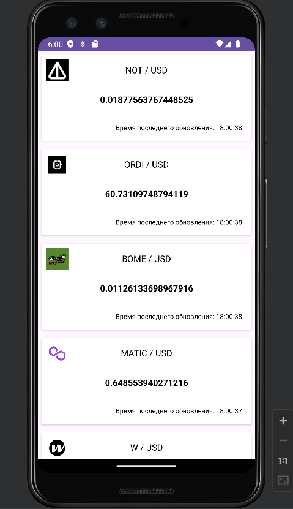

# Coin
## Technology stack
The source code of the application was written in Kotlin. MVVM was used as an architectural template. The room was used for data storage. Interaction with the network was implemented using Retrofit. The photos from the network were uploaded using Picasso. Coroutine is used for asynchronous operation. Dagger was used to implement dependency injection. Regular data updates in the background are performed using the WorkManager service.
## Screenshots

